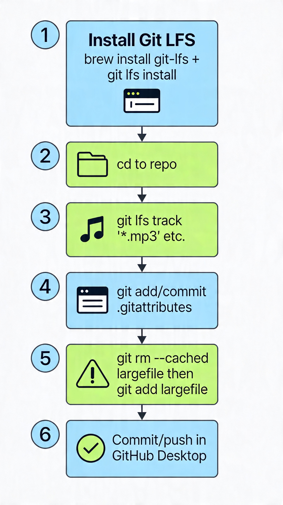

# Git LFS Setup Guide for GitHub Desktop (Mac)

<!--  -->


This guide walks you through installing and using Git Large File Storage (LFS) with GitHub Desktop to handle files >100MB (e.g., audio, videos, archives). GitHub blocks pushes with large files unless using LFS.

## Prerequisites
- Git or GitHub Desktop installed
- Terminal access (built-in on Mac)
- Homebrew (for Git LFS install)
- Complete Step-by-Step Process

### Step 1: Installing Git LFS (with homebrew)
- Installing VIA homebrew
```
brew install git-lfs
```

- Initialize globally (one-time setup)
```
git lfs install
# Output: "Git LFS initialized."
```

### Step 2: Navigate to repository 
```
cd /path/to/your/repo  # e.g., cd ~/Desktop/The-Archive
pwd                    # Confirm you're in repo
git status             # Verify Git repo
```

### Step 3: Tracking large files
```
# Common patterns for your archive
git lfs track "*.mp3" "*.wav" "*.mp4" "*.zip" "*.rar"
git lfs track "*.psd" "*.blend" "*.max" "*.fbx"
git lfs track "*.pdf"   # For large PDFs >100MB
git lfs track "Y2S2/IM2073\ Introduction\ To\ Design\ \&\ Project/BasicHorrorGameAssets/**"
```

### Step 4: Commit LFS Configuration
```
git add .gitattributes
git commit -m "Configure Git LFS tracking for large files"
```

### Step 5: Removing staged large files (Optional)
- If large files were already staged for commit
```
# Unstage large files first
git rm --cached "folder/my_large_file.mp4"

# Re-add them (now LFS handles them)
git add "folder/my_large_file.mp4"
git add path/to/other/large/files
```

### Step 6: Push and Commit
```
git commit -m "Add large files via Git LFS"
```

### Verification 
```
git lfs ls-files  # Should list your large files
```

## Summary
| Scenario                              | What Happens                 | Action Needed                                 |
| ------------------------------------- | ---------------------------- | --------------------------------------------- |
| Already tracked type (e.g., new .mp3) | ✅ Auto-handled by LFS        | None                                          |
| New file type (e.g., .mov)            | ❌ GitHub blocks push         | git lfs track "*.mov" + commit .gitattributes |
| Same repo, different branch           | ✅ LFS rules apply everywhere | None                                          |

## Quick Commands
```
git lfs ls-files          # Current LFS files
git lfs ls-files --all    # All LFS files in history
cat .gitattributes        # View tracking rules
git status                # General repo status
```

## Troubleshooting
```
| Problem                          | Solution                                         |
| -------------------------------- | ------------------------------------------------ |
| Not in a Git repository          | cd to correct repo folder                        |
| Still getting large file warning | git rm --cached largefile then git add largefile |
| GitHub Desktop ignores LFS       | Use Terminal for git lfs track first             |
| Files >1GB                       | GitHub LFS limit (upgrade plan needed)           |
```

## References
- https://docs.github.com/en/repositories/working-with-files/managing-large-files/installing-git-large-file-storage
- https://docs.github.com/en/repositories/working-with-files/managing-large-files/configuring-git-large-file-storage
- https://git-lfs.com/
- https://github.com/orgs/community/discussions/44860
- https://github.com/git-lfs/git-lfs/wiki/Tutorial